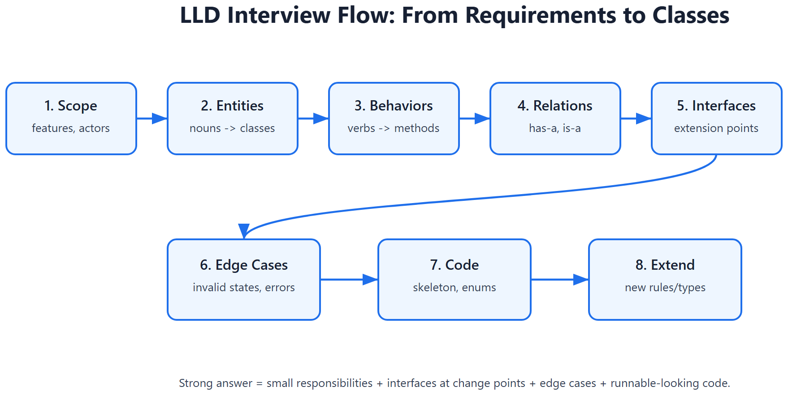
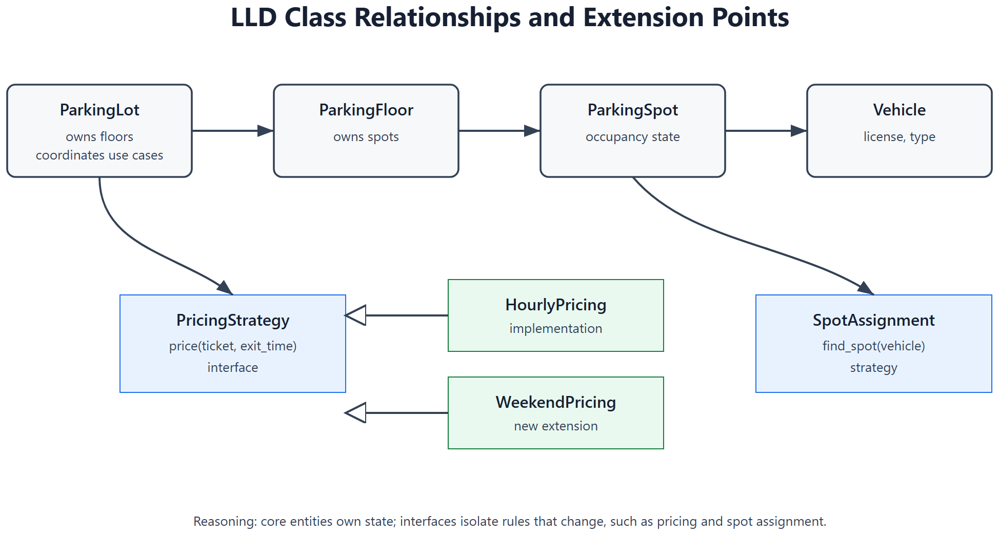
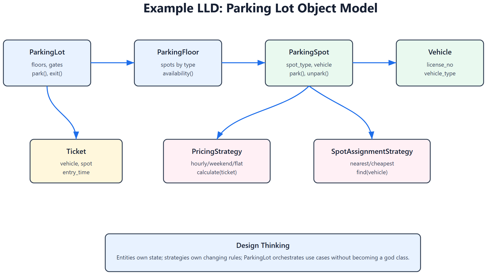

# LLD -- Low-Level Design Interview Cheatsheet







> LLD is about classes, interfaces, responsibilities, relationships, extensibility, and correctness. The interviewer wants maintainable object design, not just code.

## 1. LLD interview framework

| Step | What to do | Why |
|------|------------|-----|
| 1. Clarify scope | features, constraints, actors | avoids designing too much |
| 2. Identify entities | nouns in the problem | candidate classes |
| 3. Identify behaviors | verbs/use cases | methods/services |
| 4. Define relationships | has-a, is-a, uses-a | class structure |
| 5. Apply SOLID | interfaces, composition, single responsibility | extensibility |
| 6. Handle edge cases | invalid states, concurrency, errors | correctness |
| 7. Write code skeleton | classes, enums, methods | concrete design |
| 8. Discuss extensions | new vehicle/payment/rules | proves design quality |

## 2. LLD vs HLD

| HLD | LLD |
|-----|-----|
| System components | Classes and interfaces |
| Scale, DB, cache, queues | Methods, state, object relationships |
| APIs and data flow | Class responsibilities |
| Availability and latency | Correctness and extensibility |
| Example: URL shortener architecture | Example: code generator class design |

## 3. Core OOP principles

| Principle | Interview meaning |
|-----------|-------------------|
| Encapsulation | keep state private; expose behavior |
| Abstraction | depend on interface, not implementation |
| Inheritance | use only for true is-a relationships |
| Polymorphism | same interface, different implementation |
| Composition | build behavior by combining collaborators |

Prefer composition over inheritance unless the subtype truly satisfies the base contract.

## 4. SOLID with examples

| Principle | Bad design | Better design |
|-----------|------------|---------------|
| Single Responsibility | `Order` handles payment, invoice, shipping | separate services |
| Open/Closed | add `if vehicle == "truck"` everywhere | `Vehicle` interface |
| Liskov | `Square extends Rectangle` breaks setters | shared `Shape.area()` interface |
| Interface Segregation | one huge `Machine` interface | `Printable`, `Scannable` |
| Dependency Inversion | service creates `StripeClient()` directly | depend on `PaymentGateway` |

## 5. Class relationship vocabulary

| Relationship | Meaning | Example |
|--------------|---------|---------|
| Inheritance | is-a | `Car` is a `Vehicle` |
| Composition | owns-a, lifecycle tied | `ParkingLot` owns `Floor`s |
| Aggregation | has-a, independent lifecycle | `Team` has `Player`s |
| Association | uses-a | `OrderService` uses `PaymentGateway` |
| Dependency | temporary use | method accepts `Logger` |

## 6. Design patterns to know

| Pattern | Use case |
|---------|----------|
| Strategy | swap algorithm/rules: pricing, matching, eviction |
| Factory | create objects without exposing construction |
| Observer | event notification/subscription |
| State | object behavior changes by state |
| Command | encapsulate action: undo, queue, retry |
| Adapter | wrap incompatible external interface |
| Repository | abstract persistence |
| Builder | complex object construction |
| Chain of Responsibility | validation/filter pipeline |

## 7. Example LLD: Parking lot

### Requirements

- Multiple floors.
- Different spot types: bike, compact, large.
- Vehicles: bike, car, truck.
- Ticket generated on entry.
- Payment on exit.
- Show availability.

### Main classes

```text
ParkingLot
  - floors: List[ParkingFloor]
  - entry_gates: List[Gate]
  - exit_gates: List[Gate]

ParkingFloor
  - spots: List[ParkingSpot]

ParkingSpot
  - id
  - spot_type
  - is_free
  - park(vehicle)
  - unpark()

Vehicle
  - license_no
  - vehicle_type

Ticket
  - id
  - vehicle
  - spot
  - entry_time

PricingStrategy
  - calculate(ticket, exit_time)
```

### Design decisions

| Decision | Reasoning |
|----------|-----------|
| `PricingStrategy` interface | hourly/flat/weekend pricing can change |
| `SpotAssignmentStrategy` | nearest-first vs lowest-floor-first is swappable |
| `VehicleType` and `SpotType` enums | avoid string bugs |
| Ticket owns entry data | payment can be calculated later |
| ParkingLot coordinates, spot owns occupancy | single responsibility |

### Python skeleton

```python
from dataclasses import dataclass
from datetime import datetime
from enum import Enum
from abc import ABC, abstractmethod

class VehicleType(Enum):
    BIKE = "bike"
    CAR = "car"
    TRUCK = "truck"

class SpotType(Enum):
    BIKE = "bike"
    COMPACT = "compact"
    LARGE = "large"

@dataclass
class Vehicle:
    license_no: str
    vehicle_type: VehicleType

class ParkingSpot:
    def __init__(self, spot_id: str, spot_type: SpotType):
        self.spot_id = spot_id
        self.spot_type = spot_type
        self.vehicle: Vehicle | None = None

    def can_fit(self, vehicle: Vehicle) -> bool:
        allowed = {
            VehicleType.BIKE: {SpotType.BIKE, SpotType.COMPACT, SpotType.LARGE},
            VehicleType.CAR: {SpotType.COMPACT, SpotType.LARGE},
            VehicleType.TRUCK: {SpotType.LARGE},
        }
        return self.vehicle is None and self.spot_type in allowed[vehicle.vehicle_type]

    def park(self, vehicle: Vehicle) -> None:
        if not self.can_fit(vehicle):
            raise ValueError("vehicle cannot fit")
        self.vehicle = vehicle

    def unpark(self) -> Vehicle:
        if self.vehicle is None:
            raise ValueError("spot already empty")
        v = self.vehicle
        self.vehicle = None
        return v

@dataclass
class Ticket:
    ticket_id: str
    vehicle: Vehicle
    spot: ParkingSpot
    entry_time: datetime

class PricingStrategy(ABC):
    @abstractmethod
    def price(self, ticket: Ticket, exit_time: datetime) -> int:
        ...

class HourlyPricing(PricingStrategy):
    def price(self, ticket: Ticket, exit_time: datetime) -> int:
        hours = max(1, int((exit_time - ticket.entry_time).total_seconds() // 3600) + 1)
        return hours * 50
```

### Edge cases

- No spot available.
- Duplicate vehicle entry.
- Lost ticket.
- Payment failure.
- Concurrent entry gates assigning same spot.

Concurrency fix: lock around spot assignment or use DB transaction with row-level lock.

## 8. Example LLD: Cache with LRU eviction

### Requirements

- `get(key)` returns value or `None`.
- `put(key, value)` inserts/updates.
- Fixed capacity.
- Evict least recently used item.
- O(1) get/put.

### Design

Use hashmap + doubly linked list.

```text
HashMap: key -> Node
LinkedList: most recent near head, least recent near tail
```

### Decision reasoning

| Choice | Why |
|--------|-----|
| Hashmap | O(1) lookup |
| Doubly linked list | O(1) remove/move node |
| Head/tail sentinels | fewer edge cases |
| Strategy interface | can swap LRU for LFU/FIFO |

### Python skeleton

```python
class Node:
    def __init__(self, key=None, value=None):
        self.key = key
        self.value = value
        self.prev = None
        self.next = None

class LRUCache:
    def __init__(self, capacity: int):
        self.capacity = capacity
        self.map = {}
        self.head = Node()
        self.tail = Node()
        self.head.next = self.tail
        self.tail.prev = self.head

    def _remove(self, node):
        node.prev.next = node.next
        node.next.prev = node.prev

    def _add_front(self, node):
        node.next = self.head.next
        node.prev = self.head
        self.head.next.prev = node
        self.head.next = node

    def get(self, key):
        if key not in self.map:
            return None
        node = self.map[key]
        self._remove(node)
        self._add_front(node)
        return node.value

    def put(self, key, value):
        if key in self.map:
            self._remove(self.map[key])
        node = Node(key, value)
        self.map[key] = node
        self._add_front(node)
        if len(self.map) > self.capacity:
            lru = self.tail.prev
            self._remove(lru)
            del self.map[lru.key]
```

## 9. Example LLD: Notification system

### Requirements

- Send email, SMS, push.
- Retry failed sends.
- Users can opt out.
- Add new channel later.

### Classes

```text
NotificationService
Notification
NotificationChannel
  - EmailChannel
  - SMSChannel
  - PushChannel
PreferenceService
RetryPolicy
TemplateRenderer
```

### Design decisions

| Decision | Reasoning |
|----------|-----------|
| Channel interface | open/closed for new channel |
| Preference service | separates policy from sending |
| Template renderer | avoids mixing content with transport |
| Retry policy | backoff strategy can change |
| Command/event object | notification can be queued and retried |

## 10. Example LLD: Splitwise expense sharing

### Requirements

- Users and groups.
- Add expense paid by one user.
- Split equally or by percentage.
- Show balances.
- Settle up.

### Classes

```text
User
Group
Expense
Split
  - EqualSplit
  - PercentSplit
BalanceSheet
ExpenseService
SettlementService
```

### Design decisions

| Decision | Reasoning |
|----------|-----------|
| Split polymorphism | equal/percent/exact can be added |
| BalanceSheet separate | expense creation and balance computation differ |
| Store ledger entries | auditability and recomputation |
| Settlement service | minimizes payments separately from adding expenses |

## 11. Example LLD: Rate limiter

### Requirements

- Limit requests per user/API key.
- Support multiple algorithms.
- Work in distributed system.

### Classes

```text
RateLimiter
RateLimitStrategy
  - TokenBucketStrategy
  - SlidingWindowStrategy
LimitStore
  - InMemoryStore
  - RedisStore
RateLimitRule
```

### Design decisions

| Decision | Reasoning |
|----------|-----------|
| Strategy pattern | algorithm can change per route/user tier |
| Store abstraction | local tests use memory; prod uses Redis |
| Rule object | limits are config, not hardcoded |
| Atomic Redis script | distributed correctness |

## 12. Common LLD mistakes

| Mistake | Fix |
|---------|-----|
| Too many classes upfront | start with use cases and entities |
| God class | split responsibilities |
| Inheritance everywhere | prefer composition |
| No interfaces | hard to extend/test |
| No edge cases | discuss invalid states |
| Ignoring concurrency | mention locks/transactions where needed |
| Writing code before design | clarify requirements first |
| Overengineering | state assumptions and keep scope interview-sized |

## 13. LLD interview questions

1. Design parking lot.
2. Design elevator system.
3. Design vending machine.
4. Design LRU cache.
5. Design notification system.
6. Design Splitwise.
7. Design library management system.
8. Design rate limiter classes.
9. Design logger.
10. Design chess/tic-tac-toe.
11. Design URL shortener classes.
12. Design workflow/agent executor classes.

## 14. Final LLD checklist

- [ ] Requirements clarified.
- [ ] Entities identified.
- [ ] Class responsibilities are small.
- [ ] Interfaces introduced at extension points.
- [ ] Composition preferred over inheritance.
- [ ] SOLID principles mentioned naturally.
- [ ] Edge cases covered.
- [ ] Concurrency considered.
- [ ] Code skeleton is runnable-looking.
- [ ] Future extension is easy to explain.

