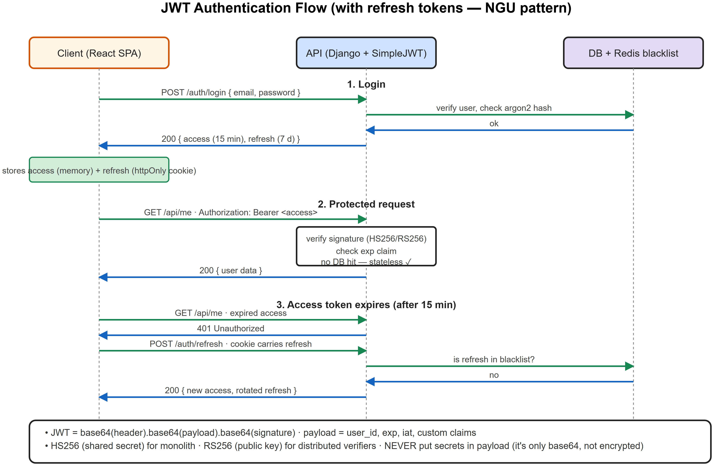
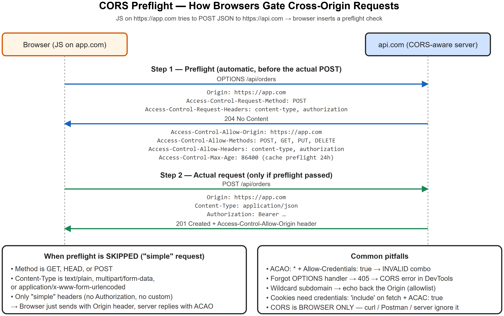
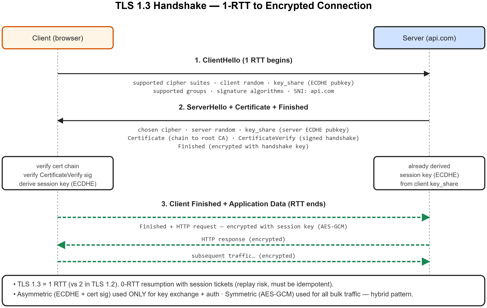
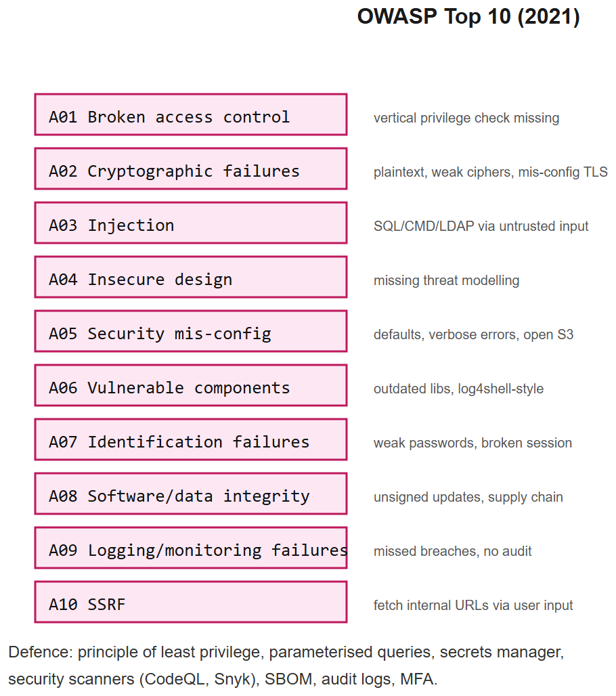

# Security -- Encryption * Hashing * CORS * SSL * RSA -- Interview Cheatsheet









## Encryption: the two families

### Symmetric -- same key encrypts + decrypts
- **AES** (Advanced Encryption Standard): 128 / 192 / 256-bit keys
- Modes: **GCM** (authenticated, default for new code), CBC (older, needs separate MAC)
- Fast -- used for bulk data
- Problem: key distribution -- how do both parties get the same key safely?

### Asymmetric -- public/private key pair
- **RSA**, **ECC**, **Diffie-Hellman**
- Public key encrypts (or verifies signatures); private key decrypts (or signs)
- Slow -- used only for key exchange and signatures, not bulk data

### The hybrid pattern (TLS does this)
1. Use **asymmetric** to securely agree on a session key
2. Use **symmetric** (AES) to encrypt the actual traffic with that key

## RSA -- what to say in interviews

### Math intuition
1. Pick two large primes `p, q`. Let `n = p * q`.
2. Compute `phi(n) = (p-1)(q-1)`.
3. Pick `e` coprime to `phi(n)`, typically `65537`.
4. Compute `d = e⁻1 mod phi(n)` (modular inverse).
5. **Public key** = `(n, e)`. **Private key** = `(n, d)`.

### Encrypt / decrypt
- Encrypt: `c = m^e mod n`
- Decrypt: `m = c^d mod n`

### Sign / verify (the more common use today)
- Sign: `s = hash(m)^d mod n`
- Verify: `s^e mod n == hash(m)`
- Anyone with public key can verify; only private-key holder can sign.

### Why is RSA secure?
Factoring `n` back into `p, q` is computationally hard for large `n` (2048-bit+). If you could factor, you'd recover `d`.

### Today's reality
- RSA-2048 is still safe for now; RSA-4096 for paranoia
- **ECC** (Curve25519, P-256) is preferred for new systems -- same security with smaller keys + faster ops
- **Post-quantum** transition coming (Kyber, Dilithium) -- quantum computers would break RSA/ECC if scaled

## Hashing

### Properties (interview definition)
A cryptographic hash function `H` should be:
- **Deterministic**: same input -> same output
- **Fast** to compute forward
- **Pre-image resistant**: hard to find `m` given `H(m)`
- **Second pre-image resistant**: hard to find `m'` with `H(m')=H(m)`
- **Collision resistant**: hard to find any `(m, m')` with same hash

### Common hashes
| Hash | Output | Use |
|------|--------|-----|
| MD5 | 128-bit | **Broken** -- checksums only, never security |
| SHA-1 | 160-bit | **Broken for security** (collisions found) |
| SHA-256 | 256-bit | Default for integrity, signatures |
| SHA-3 | variable | Newer alternative to SHA-2 |
| Blake2/3 | variable | Faster than SHA, modern |

### Password hashing -- NEVER use plain hash
Plain SHA-256 of password is **wrong** -- too fast, GPUs brute-force trivially.

Use a **slow + memory-hard** function:
- **bcrypt** -- classic, work-factor 10-12
- **scrypt** -- memory-hard, harder for ASICs
- **Argon2** (Argon2id) -- **current best**, winner of password-hashing competition

Always include a **random salt** per password -- stored alongside the hash -> blocks rainbow tables.

### HMAC
Keyed hash for message authentication: `HMAC(K, m) = H((K (+) opad) || H((K (+) ipad) || m))`. Verifies both integrity and authenticity. Used in API request signing (AWS Sig v4, webhooks).

## CORS -- Cross-Origin Resource Sharing

### What it is
Browser security rule: by default, JS on `https://a.com` can't fetch from `https://b.com`. **Same-origin policy.** CORS is the mechanism for `b.com` to opt-in to allow `a.com`.

### How it works
1. Browser sends request with `Origin: https://a.com`
2. For "simple" GETs: server responds with `Access-Control-Allow-Origin: https://a.com` (or `*`)
3. For "non-simple" (POST with JSON, custom headers, PUT/DELETE): browser first sends **preflight** `OPTIONS` request -> server must reply with allowed methods + headers + origin
4. Only then does the actual request fire

### Critical headers
- `Access-Control-Allow-Origin: https://a.com` (or `*` -- but not with credentials)
- `Access-Control-Allow-Methods: GET, POST, PUT, DELETE`
- `Access-Control-Allow-Headers: Content-Type, Authorization`
- `Access-Control-Allow-Credentials: true` (cookies / Authorization header)
- `Access-Control-Max-Age: 86400` (cache preflight)

### Common gotchas
- `Allow-Origin: *` **forbidden** with `Allow-Credentials: true` -- must specify exact origin
- CORS is **browser-enforced**; curl / Postman / server-to-server ignore it
- Not a defense against malicious servers -- only protects browsers' same-origin contract
- Preflight failures show as opaque "CORS error" in DevTools

### Django setup
```python
INSTALLED_APPS = [..., "corsheaders"]
MIDDLEWARE = ["corsheaders.middleware.CorsMiddleware", ...]
CORS_ALLOWED_ORIGINS = ["https://nidhimasala.kaushaljain.com"]
CORS_ALLOW_CREDENTIALS = True
```

## SSL / TLS

### Handshake (TLS 1.3 simplified)
1. **ClientHello** -- supported cipher suites + random + key share (ECDHE pubkey)
2. **ServerHello** -- chosen cipher + random + key share + certificate
3. Both derive symmetric session key from key-share exchange
4. Encrypted Finished messages
5. All further traffic encrypted with AES-GCM under the session key

TLS 1.3 (2018) merged steps -- handshake in 1 RTT (vs 2 in TLS 1.2), removed weak ciphers.

### Certificate chain
- **Leaf cert**: your domain, signed by intermediate CA
- **Intermediate CA**: signed by root CA
- **Root CA**: self-signed, pre-installed in browsers/OS trust store
- Browser walks chain to a trusted root

### Mutual TLS (mTLS)
Client also presents a certificate -- server verifies it. Used in service-to-service auth (microservices, banks).

### Let's Encrypt
- Free 90-day certs via ACME protocol
- `certbot` automates issuance + renewal
- HTTP-01 (file challenge) or DNS-01 (TXT record) verification

## Common attacks + defenses

| Attack | Defense |
|--------|---------|
| **SQL injection** | Parameterized queries (ORM does this) |
| **XSS** | Auto-escape templates, CSP header, sanitize HTML |
| **CSRF** | CSRF token in forms; SameSite cookies |
| **Clickjacking** | `X-Frame-Options: DENY` or CSP frame-ancestors |
| **MITM** | TLS; HSTS forces HTTPS |
| **Replay** | Nonce + timestamp in signed requests |
| **Brute-force login** | Rate limit + account lockout + slow hashing |
| **Secrets in logs** | Redact in logging middleware; secret scanners in CI |
| **SSRF** | Allowlist outbound URLs; block private IP ranges |
| **Dependency vuln** | Dependabot / Snyk; pin & audit |

## OWASP Top 10 (memorize names)
1. Broken access control
2. Cryptographic failures
3. Injection
4. Insecure design
5. Security misconfiguration
6. Vulnerable & outdated components
7. ID & auth failures
8. Software & data integrity failures
9. Logging & monitoring failures
10. SSRF

## Interview one-liners
- *AES vs RSA?* AES = symmetric, fast, bulk data. RSA = asymmetric, slow, key exchange + signatures. TLS uses both (hybrid).
- *Why hashing for passwords, not encryption?* Encryption is reversible. You should never need to recover passwords -- only verify. Plus slow hashing (bcrypt/argon2) frustrates brute force.
- *Salt?* Per-user random value mixed into hash. Stops rainbow tables; makes two users with same password have different hashes.
- *Why HMAC over plain hash?* HMAC adds a key -> integrity AND authenticity (proves who computed it).
- *CORS in one sentence?* Browser policy that lets servers opt-in to cross-origin requests; enforced only in browsers.
- *Why preflight?* Browser asks the server "may I send this non-simple request?" before sending it, to protect from servers that didn't intend to accept cross-origin writes.
- *RSA size today?* RSA-2048 minimum, 4096 paranoid. ECC (P-256, Curve25519) preferred for new designs.
- *What does a TLS cert prove?* That you control the private key for a public key, and that key is bound to a domain by a trusted CA.
- *mTLS vs TLS?* mTLS authenticates both sides via certificates. Used internally between services where API keys aren't strong enough.

## AIAAS interview anchor (security)
> "AIAAS handles user-scoped credentials for external services (Google, GitHub, OpenAI keys). They're encrypted at rest using a per-tenant data-encryption key (DEK), which itself is encrypted by a master key (KMS / envelope encryption). The DEK is only loaded into executor memory while a node runs and zeroed after. Logs are scrubbed for credential patterns. HITL gates write-actions to limit blast radius even if a credential leaks."


---

## Deep dive -- the threat-model mindset

A threat model answers four questions:
1. **What are we building?** (data flow diagram with trust boundaries)
2. **What can go wrong?** (STRIDE: Spoof / Tamper / Repudiate / Info-leak / DoS / Elevate)
3. **What are we doing about it?** (controls)
4. **Did we do a good job?** (test, review, audit)

Do this *before* coding -- it's cheaper than fixing later.

## Crypto primitives -- when to use what

| Primitive | Use |
|-----------|-----|
| Hash (SHA-256) | Integrity, content addressing -- NEVER passwords directly |
| HMAC | Message auth -- `HMAC-SHA256(key, msg)` |
| Password hashing | Argon2id / scrypt / bcrypt -- slow + salted |
| Symmetric encryption | AES-256-GCM (authenticated) |
| Asymmetric | RSA / Ed25519 / X25519 |
| Signatures | Ed25519 |
| KDF | HKDF / PBKDF2 / Argon2 |
| TLS | 1.3 only; auto-rotate certs (LetsEncrypt) |
| JWT | HS256 (shared secret) or RS256 (public key) -- beware "none" alg |

##  Common security pitfalls

| Pitfall | Fix |
|---------|-----|
| String-concat SQL | Parameterise; ORM with proper escaping |
| MD5/SHA1 for passwords | Use Argon2id with sane params |
| Comparing tokens with `==` | Use `hmac.compare_digest` (constant-time) |
| Logging tokens / PII | Redact in middleware |
| Permissive CORS (`*` + credentials) | List specific origins; deny credentials with `*` |
| Trusting `User-Agent` / `X-Forwarded-For` | Validate at proxy level |
| Missing rate limit on login | Lockout / progressive delay / captcha |
| Permissive S3 buckets | Block public access; bucket policy review |
| Outdated dependencies | Dependabot + Snyk in CI |

## Auth tactics

- **Sessions** -- server-side store, HttpOnly + Secure + SameSite cookie. Easy revocation.
- **JWT** -- stateless; great for distributed; harder to revoke (short TTL + refresh).
- **OAuth2** -- delegated auth; PKCE for SPAs; refresh token rotation.
- **MFA** -- TOTP, WebAuthn (passkeys preferred).
- **Zero-trust** -- assume the network is hostile; authenticate every request.

## Interview questions

1. **CSRF vs XSS?** CSRF tricks a logged-in browser to send a request. XSS injects script into a page. Defences differ: CSRF tokens / SameSite for CSRF; CSP + output encoding for XSS.
2. **How does TLS 1.3 differ from 1.2?** Faster handshake (1-RTT, 0-RTT for resumption), modern ciphers only, removed RSA key exchange (forward secrecy default).
3. **Hashing vs encryption for passwords?** Hash -- encryption is reversible; we should never be able to recover passwords.
4. **What's a SSRF and how to prevent it?** Server fetches a URL the user controls and hits internal targets (metadata endpoints, internal services). Whitelist domains; block private IP ranges; use a separate egress proxy.
5. **Why HttpOnly + Secure cookies?** HttpOnly hides from JS (XSS can't steal); Secure restricts to HTTPS.
6. **Difference between authentication and authorisation?** Authn proves who you are; authz decides what you can do.

## References
- OWASP Top 10 + Cheat Sheets
- *Cryptography Engineering* (Ferguson, Schneier, Kohno)
- "Designing Secure Software" (Loren Kohnfelder)
