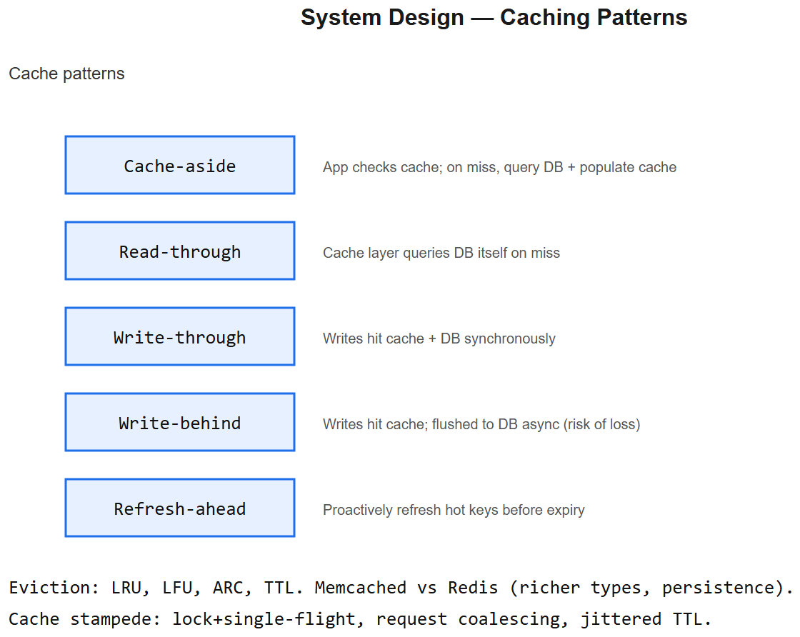
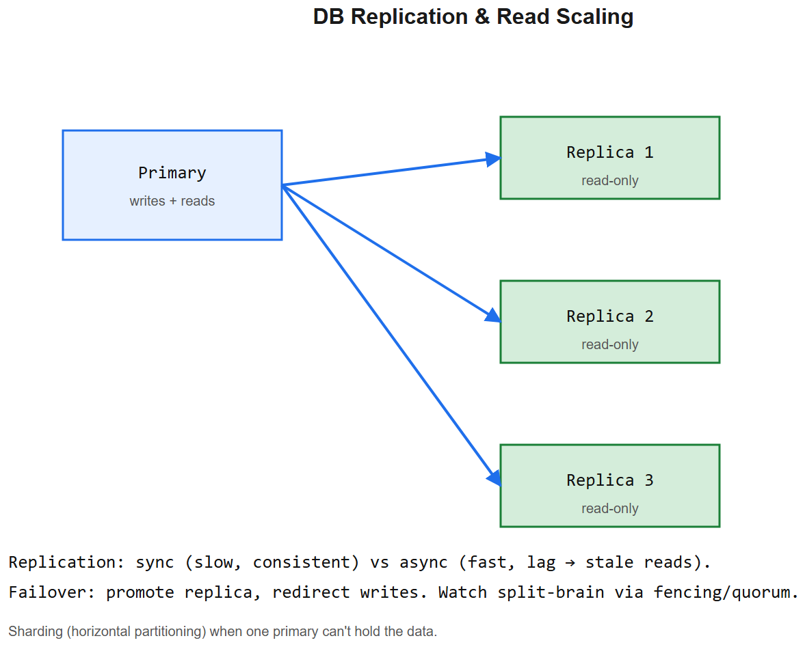

# System / API Design -- Interview Cheatsheet





>  [NGU architecture](diagrams/01-ngu-architecture.png) * [AIAAS architecture](diagrams/02-aiaas-architecture.png)

## The interview framework (memorize)

1. **Clarify requirements** (5 min)
   - Functional: what does the system do?
   - Non-functional: scale (QPS, DAU, data size), latency, consistency, availability
   - Constraints: budget, team, timeline
2. **Estimate** -- back-of-envelope (QPS, storage, bandwidth)
3. **High-level design** -- boxes + arrows. Client -> LB -> app -> DB -> cache. Draw.
4. **Deep dive** -- pick 1-2 components, go deep (data model, sharding, indexes, hot paths)
5. **Bottlenecks & scale-up** -- how do you 10x? Caching, read replicas, async work, sharding
6. **Trade-offs** -- name them explicitly: consistency vs availability, latency vs throughput, build vs buy

## Back-of-envelope numbers (memorize)

| Operation | Approx latency |
|-----------|----------------|
| L1 cache | 1 ns |
| L2 cache | 4 ns |
| RAM access | 100 ns |
| SSD read 4K | 100 mus |
| Network in datacenter (round trip) | 0.5 ms |
| Disk seek (HDD) | 10 ms |
| Network across continents | 100-200 ms |

Other useful constants:
- 1 day ~= 86,400 s ~= 105 s
- 1B / day ~= 12k / sec QPS
- 1KB x 1B docs = 1 TB

## Design pillars

### Scalability
- **Vertical** (bigger box) -- simple but capped
- **Horizontal** (more boxes) -- needs stateless services or sharding
- **Read scale**: replicas + cache
- **Write scale**: shard by key (user_id, tenant_id), CRDT, append-only logs

### Availability
- Multi-AZ deployment, health checks, autoscaling
- 99.9% = 8.7 hrs downtime/year; 99.99% = 52 min; 99.999% = 5 min
- Reduce blast radius: cell-based architecture, gradual rollout, canary deploys

### Consistency
- **Strong**: every read sees latest write (single primary, RDBMS default)
- **Eventual**: replicas converge eventually (DNS, S3, eventually-consistent caches)
- **Causal**: respects cause->effect ordering (good middle ground for chat, comments)

### Latency vs throughput
- Latency-critical (chat, gaming): low p99, accept lower throughput
- Throughput-critical (batch, analytics): maximize ops/sec, accept higher latency

## Caching strategies

### Where to cache
- **Browser** -- `Cache-Control` headers
- **CDN** -- edge caches (CloudFront)
- **Reverse proxy** -- Nginx
- **Application** -- Redis / Memcached
- **DB query cache** -- built-in or materialized views

### Patterns
- **Cache-aside (lazy)**: app reads cache; on miss, query DB + populate cache
- **Write-through**: writes go to cache + DB synchronously (cache always fresh)
- **Write-back**: writes to cache, flushed to DB later (risk of data loss)
- **Read-through**: cache itself fetches from DB on miss

### Invalidation (the hard part)
- **TTL** -- simplest, eventually fresh
- **Explicit invalidation on write** -- like NGU's signal-based: post_save -> invalidate keys
- **Versioned keys / namespaces** -- bump version -> old keys become unreferenced
- **Cache stampede protection**: lock during miss-refill; or serve-stale-while-refresh

## REST API design

### Resource modeling
```
GET    /products              list
POST   /products              create
GET    /products/{id}         retrieve
PUT    /products/{id}         replace
PATCH  /products/{id}         partial update
DELETE /products/{id}         delete
GET    /products/{id}/reviews nested
```

### Status codes (know which)
- 200 OK, 201 Created, 204 No Content
- 301/302 Redirect, 304 Not Modified
- 400 Bad Request, 401 Unauthorized, 403 Forbidden, 404 Not Found, 409 Conflict, 422 Unprocessable, 429 Too Many
- 500 Server Error, 502 Bad Gateway, 503 Unavailable, 504 Timeout

### Best practices
- **Versioning**: `/api/v1/...` or `Accept: application/vnd.api.v2+json`
- **Pagination**: cursor (preferred) > offset for large datasets
- **Filtering / sorting**: `?status=active&sort=-created_at`
- **Idempotency keys** on POST/PATCH to dedupe retries
- **Rate limiting** with `X-RateLimit-*` headers + 429
- **Consistent error shape**: `{error: {code, message, details}}`
- **HATEOAS** (links in responses): nice in theory, rarely worth it

### REST vs GraphQL vs gRPC
| | REST | GraphQL | gRPC |
|--|------|---------|------|
| Format | JSON | JSON | Protobuf (binary) |
| Schema | OpenAPI optional | Required | Required |
| Overfetching | Yes | No (client picks fields) | N/A |
| Best for | Public APIs, simple CRUD | Mobile apps with many resource types | Internal microservices, streaming |
| Caching | HTTP cache friendly | Harder | N/A |

## Common patterns

### Idempotency
Make endpoints safe to retry. Either inherently idempotent (PUT, DELETE) or add an `Idempotency-Key` header -> store result of first call -> return same result on retry.

### Async / background jobs
Slow work (emails, image processing, LLM batch) goes to a queue (Celery, SQS, Redis streams). API returns 202 + job ID; client polls or subscribes via WebSocket for status.

### Rate limiting algorithms
- **Token bucket** -- bucket fills at rate R; each request takes one token. Allows bursts up to bucket size.
- **Leaky bucket** -- fixed-rate drain. Smoothes bursts.
- **Fixed window** -- count per minute. Cliff at minute boundary.
- **Sliding window** -- running count over last N seconds. Smoother.
- **Distributed**: use Redis with atomic INCR + EXPIRE.

### Pub/sub
Producers publish to topic, consumers subscribe. Decouples writers from readers. Kafka (durable, replayable), Redis pub/sub (ephemeral, fast), NATS, RabbitMQ.

### Circuit breaker
After N failures to a downstream, "open" the circuit -> fail fast for a cooldown period -> "half-open" -> probe -> close on success. Stops cascading failures.

### Bulkhead
Isolate failure: separate thread pools / connection pools per downstream so one slow service can't starve the others.

## Sharding strategies
- **Range sharding** -- `user_id` 1-1M on shard A, 1M-2M on shard B. Hot spots possible.
- **Hash sharding** -- `hash(user_id) % N`. Even distribution; hard to add shards (resharding).
- **Consistent hashing** -- ring; adding a node only re-shards a fraction. Used in DynamoDB, Cassandra, Redis Cluster.
- **Directory-based** -- lookup table mapping key -> shard. Flexible, central point of failure.

## Data store choices

| Need | Pick |
|------|------|
| Relational + transactions | Postgres / MySQL |
| Document-oriented | MongoDB / Postgres JSONB |
| Wide-column / time-series | Cassandra / ScyllaDB / TimescaleDB |
| Key-value | Redis / DynamoDB |
| Search | Elasticsearch / OpenSearch / Typesense |
| Vector / ANN | pgvector / Qdrant / Pinecone / Weaviate |
| Graph | Neo4j / Memgraph |
| Object store | S3 / GCS |
| Stream | Kafka / Kinesis / Redpanda |

## Trade-off vocabulary (interviewer's catnip)
- **CAP**: in a network partition, choose Consistency or Availability
- **PACELC**: if Partition, choose A or C; Else (normal) choose Latency or Consistency
- **Push vs pull** -- client subscribes (push) vs polls (pull). Push has lower latency, more state.
- **Sync vs async** -- wait or return immediately and notify later
- **Stateless vs stateful** -- stateless scales horizontally for free
- **Optimistic vs pessimistic locking** -- optimistic: version field, retry on conflict; pessimistic: explicit lock, blocks

## Interview templates -- quick answers

### "Design URL shortener"
- API: POST /shorten -> returns short code; GET /code -> 302 redirect
- Generate code: base62 of auto-inc OR random + collision check
- Storage: `(code, long_url, user, created, expires)` -> Postgres + Redis cache for hot codes
- Scale: read-heavy -> cache aggressively; analytics async via Kafka

### "Design rate limiter"
- Token bucket per (user, route) in Redis: key holds (tokens, last_refill_ts)
- Atomic Lua script: refill based on elapsed, decrement, return allowed/denied
- Distributed: Redis is the source of truth; client libraries check before calling

### "Design feed (Twitter)"
- Fan-out on write (push to followers' inboxes) for low-follower users
- Fan-out on read for celebrities (millions of followers); merge at read time
- Hybrid: pre-compute for warm cells, merge celeb posts at read

### "Design rideshare matching"
- Geohash drivers + riders to cell IDs
- Match within cell + neighbors, by distance + ETA
- Pub/sub for live driver positions; Redis sorted sets per cell

## NGU + AIAAS interview anchors

### NGU at scale
See [diagrams/01-ngu-architecture.svg](diagrams/01-ngu-architecture.png). Talking points: stateless Django, Redis cache layer with namespaced keys + signal invalidation, RDS read replicas, S3 + CloudFront for media, Celery for emails / image processing.

### AIAAS architecture
See [diagrams/02-aiaas-architecture.svg](diagrams/02-aiaas-architecture.png). Talking points: compiler/executor separation (catches errors before tokens spent), durable state checkpointing, WebSocket pub/sub via Redis for live status, MCP servers as plug-in tool architecture, encrypted credential isolation, HITL approval gates.


---

## Deep dive -- the system-design framework

The interviewer wants to see structured thinking, not memorised topology. Standard playbook:

1. **Clarify scope & scale** -- DAU, QPS, data volume, geographic distribution.
2. **Functional requirements** -- explicit, prioritised user stories.
3. **Non-functional** -- availability, latency, consistency, durability.
4. **Capacity estimate** -- back-of-envelope (e.g. 100M DAU x 10 reqs ~= 10k QPS).
5. **API design** -- REST/gRPC endpoints, request/response shapes.
6. **Data model** -- entities, indexes, sharding key.
7. **High-level architecture** -- client -> LB -> service -> cache -> DB.
8. **Deep dive on 1-2 components** -- usually the one with hardest scale.
9. **Trade-offs** -- explicitly say what you're giving up.
10. **Bottlenecks & scaling** -- read replicas, sharding, CDN, async queues.

## Latency / throughput numbers you should know

| Operation | Order of magnitude |
|-----------|-------------------|
| L1 cache | 1 ns |
| RAM access | 100 ns |
| SSD random read | 100 mus |
| Network round-trip in DC | 0.5 ms |
| HDD seek | 10 ms |
| Cross-continent RTT | ~150 ms |
| Read 1 MB from SSD | 1 ms |
| Read 1 MB from network | 10 ms |

## Capacity math sketches

- 1M DAU x 10 actions = **10M actions/day** ~= **115 actions/sec avg**, peak ~5x = **600 QPS**.
- Each action 1KB metadata -> **10 GB/day** -> **3.6 TB/year** before replication.
- Each user 10MB media -> **10 TB total** (cap planning).

## Scale patterns

| Bottleneck | Fix |
|------------|-----|
| Read-heavy DB | Read replicas + cache |
| Write-heavy DB | Shard by user_id / hash |
| Hot key | Replicate to N partitions, write to random |
| Cross-region latency | CDN for static, edge functions for compute |
| Sync RPC fan-out | Convert to async queue (Kafka / SQS) |
| Tight consistency required | Single-leader writes (Spanner / Cockroach) |
| Auth bottleneck | Stateless JWT or distributed session cache |

## Interview questions

1. **CAP theorem in practice?** During partition, choose consistency (banking) or availability (social feed); modern systems often surface tunable consistency per query.
2. **Hot key problem and mitigations?** Random-write replicas, request coalescing, client-side caching, write-ahead log shedding.
3. **Idempotency on retries?** Idempotency key on writes; dedupe table; client retries safe by design.
4. **Backpressure?** Token bucket / leaky bucket; bounded queues; reject vs degrade.
5. **Design Twitter feed -- push vs pull?** Push (fan-out on write) for normal users, pull (fan-in on read) for celebrities -- hybrid.

## References
- *Designing Data-Intensive Applications* (Kleppmann) -- must-read
- "The Twelve-Factor App"
- Donne Martin's system-design-primer (GitHub)
