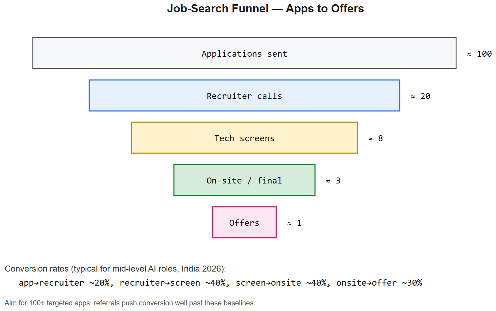
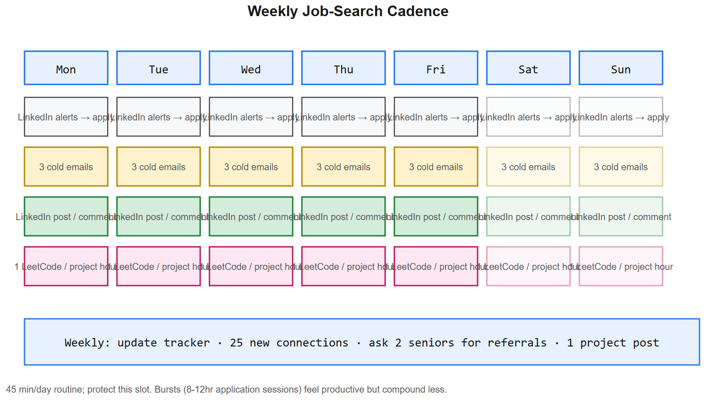
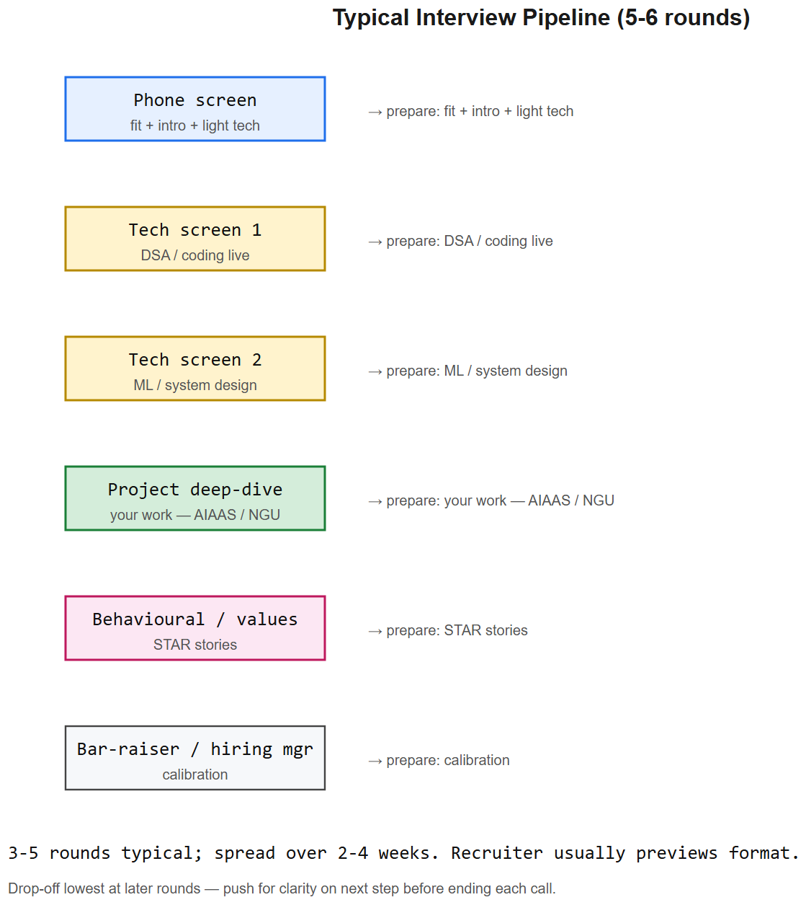

# Job-Search Playbook -- AI Engineer @ 10+ LPA







> Goal: convert handwritten Page-2 notes into a weekly operating plan with templates and tooling.

## Targeting

- **Role titles to search:** "AI Engineer", "ML Engineer", "LLM Engineer", "Applied AI Engineer", "GenAI Engineer", "AI Research Engineer", "AI Platform Engineer"
- **Company tiers (apply to all in parallel):**
  1. **YC-backed early-stage startups** -- ycombinator.com/jobs, Work at a Startup (workatastartup.com). 8-15 LPA + equity common; senior IC reach.
  2. **Indian AI startups** -- Sarvam, Krutrim, Ola Maps AI, Glance AI, Fractal, Mu Sigma, Yellow.ai, Haptik, Observe.AI, AIShakti, Niramai, Zluri.
  3. **Mid-size product companies in Mohali/Bengaluru/Gurugram** -- Razorpay, CRED, Swiggy, Zomato, Meesho, PhonePe, Atlassian (B'luru), Flipkart, ShareChat, InMobi.
  4. **Offshore / remote-friendly** -- Turing.com, Andela, Toptal, Crossover, Deel-listed roles, Arc.dev, X-Team, RemoteOK.
  5. **PEC alumni network** -- LinkedIn search `"PEC" OR "Punjab Engineering College" AI OR ML`, alumni job boards.

## Application channels (ranked by ROI)

| Channel | Effort | Hit rate | Notes |
|---------|--------|----------|-------|
| **Referrals via seniors/family/PEC alumni** | Medium | **Highest** | Always ask first before cold applying |
| **Cold email to founders/HR** | Medium | High at <50-person startups | Templates below |
| **LinkedIn -- apply within 24h of posting** | Low | Medium-high | Set keyword alerts |
| **YC / Work at a Startup** | Low | High for early-stage | Easy single-form apply |
| **LinkedIn EasyApply** | Very low | Low (noisy) | Do these in bulk while alerts fire |
| **In-person office drop-ins** | High | Low but memorable | Only for Mohali/B'luru/Gurugram visits |
| **Freelance bridges (Upwork/Toptal)** | High | Backup income while interviewing | Helps resume + cash flow |

## Weekly operating cadence

**Daily (45 min):**
- Check LinkedIn job alerts -> apply within 24 hrs of posting (recruiters reach out to first 50 applicants disproportionately)
- 3 cold emails to startup founders / HR
- 1 LinkedIn post or comment on AI engineering thread

**Weekly:**
- Update tracker spreadsheet (Company / Role / Channel / Date / Stage / Next action)
- 1 LinkedIn post showcasing a project or learning -- keep it technical, not "open to work"
- Connect with 25 new people: AI engineers at target companies, recruiters, PEC alumni
- Ask 2 seniors for either a referral or a 15-min advice call

**Monthly:**
- Refresh resume against 3 most-recent job descriptions
- 1 medium-form blog post (Medium / Substack / personal site) on a project deep-dive

## Cold email templates

### To a founder of a small AI startup
```
Subject: AI engineer interested in <Company> -- built <relevant project>

Hi <Name>,

I came across <Company>'s work on <specific product/feature> and noticed
you're working on <specific problem from their landing page>.

I'm an AI engineer with experience in <RAG / agents / fine-tuning / etc.>.
A relevant project: <1 line -- "Built X using Y, achieved Z metric, repo at <link>">.

I'd love to contribute to <Company>. Are you open to a 15-min chat next
week, or would it be more useful if I sent a short proposal for
<specific feature you'd build>?

Resume: <link>
GitHub: <link>

<Your name>
```

### To an HR at a mid-size company
```
Subject: AI Engineer application -- <Your name> (<years> yrs, <key stack>)

Hi <Name>,

I'm applying for the <Role> position at <Company> (ref: <job ID/link>).

Quick highlights:
- <1 line on most relevant project -- tech + outcome>
- <1 line on second project>
- <1 line on a metric or scale you handled>

Resume attached. Happy to send code samples or jump on a call.

Thanks,
<Your name>
```

### To a PEC senior for referral
```
Subject: PEC '<year> alum -- quick referral request for <Company>?

Hi <Name>,

<Your name>, PEC '<your batch> here. Saw on LinkedIn that you're at <Company>
on the <team> team -- congrats on the move.

I'm applying for <Role>. My background: <one line -- AI engineer, X yrs, Y stack>.
Relevant project: <one line>.

Would you be open to referring me? Happy to send resume, JD link, or hop on
a 10-min call so you can vet me first -- totally understand if not.

Resume: <link>

Thanks,
<Your name>
```

## LinkedIn checklist

- [ ] Headline: "AI Engineer * LLMs * RAG * Agents * Python / Django" (not "Open to work")
- [ ] About: 3 short paragraphs -- what you do, top projects with metrics, what you're looking for
- [ ] Featured: pin 3 best project links (GitHub repo + live demo + blog post)
- [ ] Experience: each role has 3-5 bullets with metric per bullet
- [ ] Skills: AI/ML, Python, Django, React, Docker, AWS, LangChain/LangGraph, PyTorch, Pinecone/FAISS, MCP
- [ ] **300-500 connections minimum**, ideally 1000+ -- connect with target-company employees + recruiters
- [ ] Set job alerts: 5-10 keyword + city combinations
- [ ] Set "Open to opportunities" recruiter-only (not public banner)
- [ ] **Post weekly**: project demos, "I built X this week", lessons learned. Tag tools used (LangChain, etc.) to surface in their networks.
- [ ] Comment thoughtfully on 5 AI-engineer posts/week to grow visibility

## Resume alignment automation

> The handwritten note "Create a system of notification, Resume alignment, automatic application" is a *good* small project -- build it and put it on the resume itself.

Stack idea:
- **Scraper:** LinkedIn job search -> cron job using Playwright (RSS isn't reliable on LinkedIn). Backup: indeed.com/jobs RSS, ycombinator/jobs.
- **Storage:** Postgres or SQLite. Tables: jobs, companies, applications.
- **Notifier:** Telegram bot / email digest with new postings ranked by JD-vs-resume match score.
- **Resume aligner:** LLM (Claude/GPT) takes JD + base resume -> generates a tailored version with matching keywords. Save versions per company.
- **Auto-apply (cautious):** semi-automate -- generate the cover-letter draft + click-by-click checklist; humans submit. Fully automated submissions get accounts banned and look spammy.

Recommended tools to integrate instead of building from scratch where possible: Hiration, Teal, Simplify.jobs (Chrome extension auto-fills applications), Reachout.ai for outreach.

## Recommendation strategy

- Ask **3 managers + 2 peers + 1 client/customer** from past projects for written recommendations.
- Provide them with 3 bullet points each so they don't start from blank.
- Get them on LinkedIn for public visibility; also collect email-form recommendations to forward to recruiters.

## LinkedIn content calendar (4-week starter)

| Week | Post topic |
|------|------------|
| 1 | "I built <project>" -- screenshot/GIF + 5-bullet what-I-learned |
| 2 | "Reading list for getting good at <RAG / agents / LoRA>" -- links + 1-line takeaway each |
| 3 | "Common bug I hit with <library>" -- short case study + fix |
| 4 | "If I were starting <year> as an AI engineer, here's the curriculum" -- list with reasoning |

## Tracker spreadsheet columns

`Date applied | Company | Role | Channel (referral/cold/LinkedIn) | JD link | Resume version | Cover letter? | Recruiter contact | Stage | Next action | Next-action date | Notes`

Use Notion, Airtable, or Google Sheets. Review weekly.

## Red flags / things to avoid

- Don't put "Open to work" green banner on LinkedIn -- recruiters often filter it out; senior roles especially.
- Don't apply to >50 jobs/day in batches -- quality > quantity, and LinkedIn throttles you.
- Don't auto-submit applications via bot -- accounts get banned and your reputation gets logged in recruiter ATSes.
- Don't lie about YoE -- easy to verify and the AI/ML community is small.
- Don't quote 10+ LPA at first contact -- let them ask first, then anchor at desired number with justification.


---

## Deep dive -- interview prep blueprint (12-week sprint)

| Weeks | Focus | Daily target |
|-------|-------|--------------|
| 1-2 | DSA refresh (NeetCode 150) | 3 problems/day + 1 pattern review |
| 3-4 | ML/DL fundamentals + math derivations | 1 cheatsheet + 1 paper summary |
| 5-6 | Transformers / LLMs / RAG | 1 deep file + 1 hands-on demo |
| 7-8 | System design + low-latency LLM serving | 1 mock problem written out |
| 9-10 | Behavioural + STAR stories + project narratives | refine pitch, mock with a friend |
| 11-12 | Mock interviews (5+) + iterate | rest day after each, debrief |

## Common interview questions to drill

1. **Tell me about a recent project.** STAR -- situation, task, action, result. 90 sec.
2. **Walk me through your AIAAS architecture.** Use the diagram in 09-System-Design-Security/diagrams/02-aiaas-architecture.svg.
3. **Train/tune an LLM -- what's the workflow?** Tokenise -> continue-pretrain (optional) -> SFT -> DPO/RLHF -> eval.
4. **Implement scaled dot-product attention from scratch.** Be ready to write the einsum + mask + softmax.
5. **Production ML systems -- how do you monitor drift?** Distribution diff, performance proxies, alerts on regressions.

## Salary negotiation in one paragraph

Always state a *range* anchored to current market data -- not your past salary. For mid-level AI Engineer in India 2026, total comp commonly lands 18-45 LPA depending on tier. Sources: Levels.fyi (India tab), Glassdoor, recent LinkedIn announcements. Ask for total comp breakdown: base, bonus, ESOPs (vesting + strike), joining bonus, relocation. Never accept on the same call.

## References
- *Cracking the Coding Interview* (Gayle Laakmann McDowell) -- DSA + interview structure
- "STAR method" -- for behavioural questions
- Levels.fyi -- comp data
- *System Design Interview Vol I & II* (Alex Xu)
