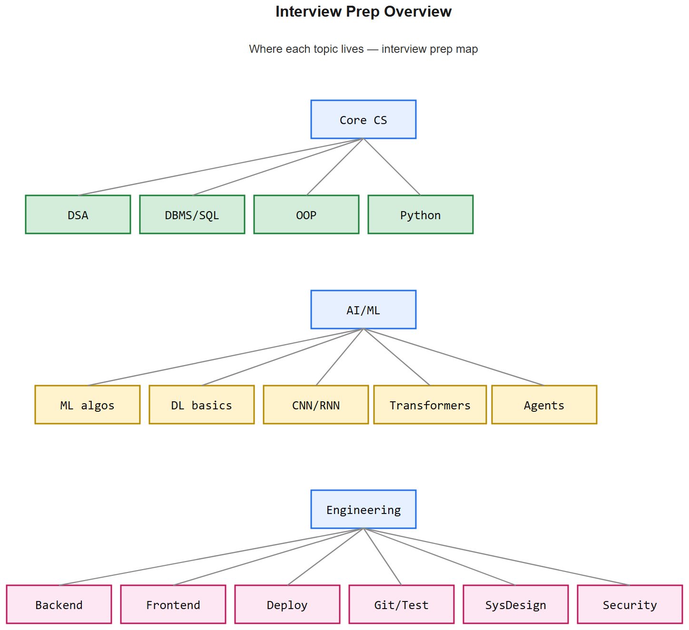

# Interview Prep -- AI Engineer (10+ LPA)

## How to use this folder

- **[SYLLABUS.md](SYLLABUS.md)** -- Full topic list with one-line descriptions of *why* each topic matters
- **[TOC.md](TOC.md)** -- Clickable table of contents with status checkboxes -- your daily revision tracker
- **Per topic:**
  - `*-cheatsheet.md` -- 1-2 pages, fast revision (definitions, formulas, code snippets, one-liner interview answers)
  - `*-deep.md` -- 3-5 pages (explanations, examples, pitfalls, 20-30 interview Qs with model answers, references)
- **[cheatsheets/](cheatsheets/)** -- Community PDF cheatsheets downloaded from the web
- **[JOB-SEARCH/playbook.md](JOB-SEARCH/playbook.md)** -- Application strategy (cold-emails, LinkedIn, referrals, YC startups)

## Suggested revision cadence

| Phase | Time | Focus |
|-------|------|-------|
| Week 1-2 | 2 hrs/day | **CS Fundamentals** + **DSA** daily (1 hr) |
| Week 3-4 | 2 hrs/day | **Transformers/LLMs** + **AI Agents** (your differentiators) |
| Week 5 | 2 hrs/day | **ML/DL foundations** |
| Week 6 | 2 hrs/day | **Backend Django** + **Frontend React** |
| Week 7 | 2 hrs/day | **Deployment** + **VCS/Testing** + **System Design** |
| Week 8+ | 1 hr/day | Cheatsheet-only revision + mock interviews |

DSA practice is parallel throughout -- minimum 2 LeetCode mediums/day.

## Progress tracking

Edit `TOC.md` checkboxes: `[ ]` -> `[~]` (revising) -> `[x]` (revised + can teach it).

## Status

This notes set is being generated in waves. Open `TOC.md` to see what's done.
